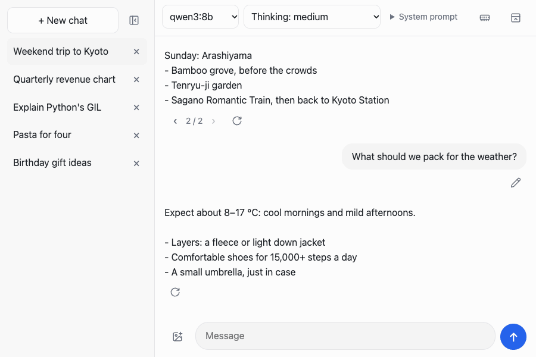
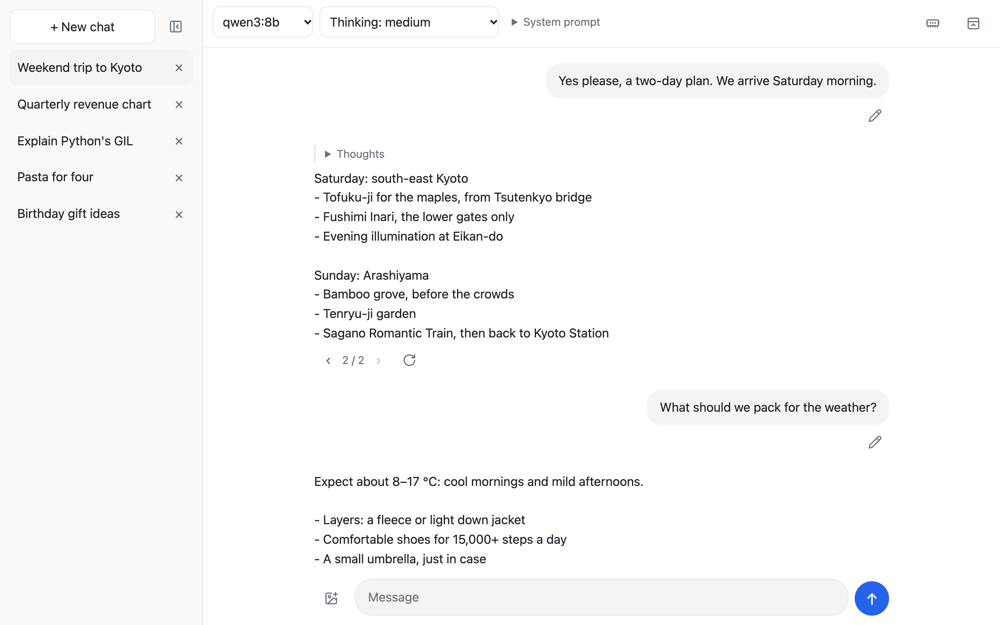
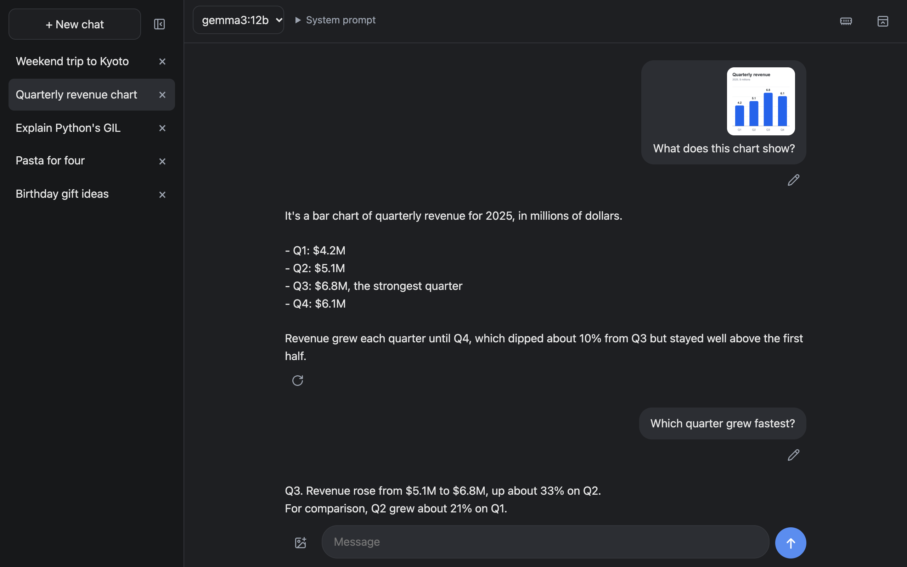
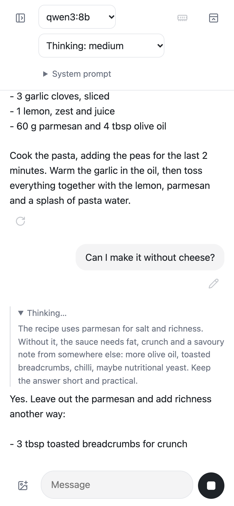
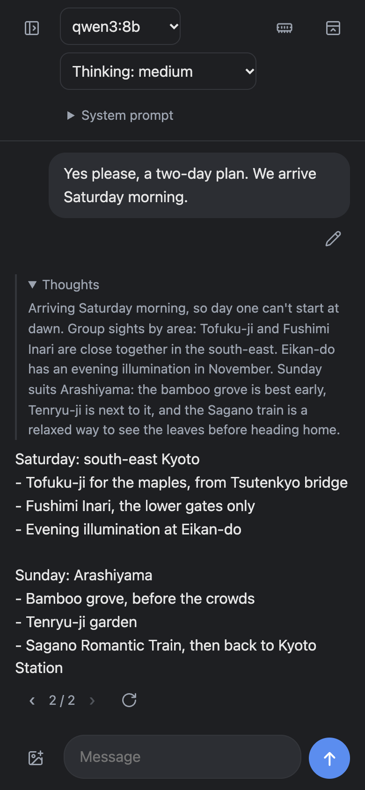
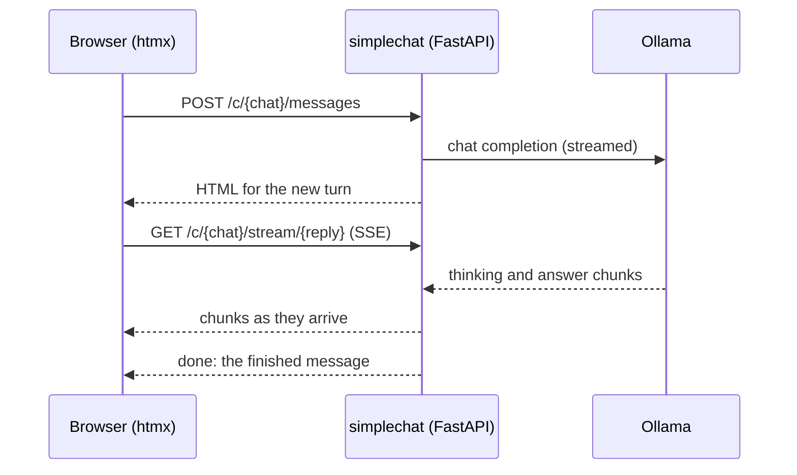

<div align="center">

# simplechat

**A small, fast, ChatGPT-style chat UI for your local [Ollama](https://ollama.com) models.**

No frontend build, no database, no account.<br>
One `uv run`, then chat from your laptop, or from your phone on the same Wi-Fi.

[](https://www.python.org/)
[](https://fastapi.tiangolo.com/)
[](https://htmx.org/)
[](https://ollama.com/)
[](LICENSE)



</div>

## Screenshots

<table>
  <tr>
    <td width="50%"></td>
    <td width="50%"></td>
  </tr>
  <tr>
    <td align="center">Branching chats, collapsible thoughts</td>
    <td align="center">Dark mode and images for vision models</td>
  </tr>
</table>

<p align="center">
  
  &nbsp;&nbsp;
  
</p>

## Features

- 💬 **Streaming replies**, with a **Stop** button that ends a reply early and keeps what was written so far.
- 🌿 **Edit and regenerate without losing anything.** Every version is kept; switch between them with ‹ 1 / 2 ›.
- 🧠 **Thinking models:** pick the thinking level for each chat (off, low, medium, high, as the model allows), and read the model's thoughts in a collapsible section.
- 🖼️ **Images for vision models:** attach them (on a phone, straight from the camera) or paste them, preview them before sending, and drop them when editing.
- 🎛️ **Per-chat settings:** model, thinking level, and a system prompt saved with an explicit Save button.
- 📱 **Made for phones too:** responsive layout, a slide-in chat list, and the address to open printed at startup.
- 🧹 **Room when you need it:** collapse the chat list and the top bar; each browser remembers your choice.
- 🪶 **Free memory:** one button unloads every model from Ollama (weights and KV cache), without restarting it.
- 🌗 **Light and dark mode**, following your system.

Conversations live in memory, so they're gone when the server stops. That keeps the app simple, with nothing to set up or clean up.

## Quick start

You need [uv](https://docs.astral.sh/uv/) and a running [Ollama](https://ollama.com) with at least one model.

```sh
ollama pull qwen3            # any model works; vision and thinking models unlock more features
git clone https://github.com/moskomule/simplechat.git
cd simplechat
uv run simplechat
```

uv installs Python 3.14 and the dependencies on first run. Then open the address it prints:

```
SimpleChat: http://localhost:8000
On your local network: http://192.168.1.23:8000
```

### Use it from your phone

Open the second address on any device on the same network. On macOS, allow incoming connections if the firewall asks. Ollama itself can stay bound to `localhost`, because only simplechat talks to it.

To choose another port, or to keep it to this machine only:

```sh
uv run simplechat --port 8080
uv run simplechat --host 127.0.0.1
```

## Keyboard

| Key | Where | Action |
|---|---|---|
| <kbd>Enter</kbd> | Message box | Send (on touch devices, a new line; send with the button) |
| <kbd>Shift</kbd>+<kbd>Enter</kbd> | Message box | New line |
| <kbd>Ctrl</kbd>/<kbd>⌘</kbd>+<kbd>Enter</kbd> | System prompt | Save |

Enter that confirms Japanese or other IME input never sends.

## Configuration

Environment variables. `--host` and `--port` take precedence over `HOST` and `PORT`.

| Variable | Default | Description |
|---|---|---|
| `OLLAMA_URL` | `http://localhost:11434` | Ollama server |
| `DEFAULT_MODEL` | first model Ollama lists | Model for new chats |
| `HOST` | `0.0.0.0` | Address to bind; `127.0.0.1` keeps it local |
| `PORT` | `8000` | Port to listen on |
| `OLLAMA_API_KEY` | `ollama` | Ignored by Ollama, but required by the OpenAI client |

Run a single server process: conversations live in its memory.

## How it works

simplechat renders HTML on the server and lets [htmx](https://htmx.org/) swap it into the page. Replies stream over Server-Sent Events. There's no JavaScript framework and no build step; htmx is vendored, so it also works on a network without internet access.



Replies are generated in the background, not by the request that asked for them. A reload, a dropped connection or a second device simply follows along, and the model is asked only once. Chat goes through Ollama's OpenAI-compatible API; thinking levels, vision support and unloading use its native API.

More detail for contributors is in [CLAUDE.md](CLAUDE.md).

## Development

```sh
uv run pytest            # tests; Ollama is not needed
uv run ruff check --fix  # lint
uv run ruff format       # format
```

## License

[MIT](LICENSE)
